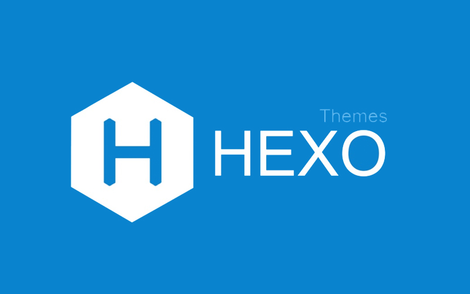

# Awsome-hexo-themes

> A list of awsome hexo themes, sorted by stars.

## Content

| Name  | Description | Star  |
| ---- | ---- | ---- |
|[iissnan/hexo-theme-next](https://www.github.com/iissnan/hexo-theme-next)|Elegant theme for Hexo.|15.5k|
|[litten/hexo-theme-yilia](https://www.github.com/litten/hexo-theme-yilia)|一个简洁优雅的hexo主题 A simple and elegant theme for hexo.|7.8k|
|[theme-next/hexo-theme-next](https://www.github.com/theme-next/hexo-theme-next)|Elegant and powerful theme for Hexo.|6.3k|
|[ppoffice/hexo-theme-icarus](https://www.github.com/ppoffice/hexo-theme-icarus)|A simple, delicate, and modern theme for the static site generator Hexo.|4.3k|
|[viosey/hexo-theme-material](https://www.github.com/viosey/hexo-theme-material)|Material Design theme for hexo.|3.9k|
|[blinkfox/hexo-theme-matery](https://www.github.com/blinkfox/hexo-theme-matery)|A beautiful hexo blog theme with material design and responsive design.一个基于材料设计和响应式设计而成的全面、美观的Hexo主题。国内访问：http://blinkfox.com/|2.9k|
|[yscoder/hexo-theme-indigo](https://www.github.com/yscoder/hexo-theme-indigo)|一个Material Design风格的Hexo主题。 https://imys.net/|2.7k|
|[fluid-dev/hexo-theme-fluid](https://www.github.com/fluid-dev/hexo-theme-fluid)|🌊 一款 Material Design 风格的 Hexo 主题 / An elegant Material-Design theme for Hexo|2.1k|
|[probberechts/hexo-theme-cactus](https://www.github.com/probberechts/hexo-theme-cactus)|🌵 A responsive, clean and simple theme for Hexo.|1.8k|
|[pinggod/hexo-theme-apollo](https://www.github.com/pinggod/hexo-theme-apollo)|🌅 a concise hexo theme|1.8k|
|[jerryc127/hexo-theme-butterfly](https://www.github.com/jerryc127/hexo-theme-butterfly)|🦋 A Hexo Theme: Butterfly|1.8k|
|[LouisBarranqueiro/hexo-theme-tranquilpeak](https://www.github.com/LouisBarranqueiro/hexo-theme-tranquilpeak)|💄 A gorgeous responsive theme for Hexo blog framework|1.7k|
|[Molunerfinn/hexo-theme-melody](https://www.github.com/Molunerfinn/hexo-theme-melody)|🎹A simple & beautiful & fast theme for Hexo.|1.3k|
|[ahonn/hexo-theme-even](https://www.github.com/ahonn/hexo-theme-even)|🚀 A super concise theme for Hexo|1.2k|
|[fi3ework/hexo-theme-archer](https://www.github.com/fi3ework/hexo-theme-archer)|🏹 A smart and modern theme for Hexo.|1.1k|
|[ppoffice/hexo-theme-hueman](https://www.github.com/ppoffice/hexo-theme-hueman)|A redesign of Alx's wordpress theme Hueman, ported to Hexo.|1.1k|
|[forsigner/fexo](https://www.github.com/forsigner/fexo)|A minimalist design theme for hexo.|1.1k|
|[wuchong/jacman](https://www.github.com/wuchong/jacman)|Jacman is a fresh looking and responsive theme for Hexo with more features based on Pacman.|1k|
|[shenliyang/hexo-theme-snippet](https://www.github.com/shenliyang/hexo-theme-snippet)|Snippet 简洁而不简单，也许是一款你寻找已久的hexo主题|971|
|[volantis-x/hexo-theme-volantis](https://www.github.com/volantis-x/hexo-theme-volantis)|A Wonderful Theme for Hexo https://volantis.js.org|960|
|[Fechin/hexo-theme-diaspora](https://www.github.com/Fechin/hexo-theme-diaspora)|Hexo theme, Blog theme, Clean, Responsive theme|944|
|[Haojen/hexo-theme-Anisina](https://www.github.com/Haojen/hexo-theme-Anisina)|🎨 A simple responsive , support qiniu image cdn theme for hexo https://haojen.github.io/|744|
|[Shen-Yu/hexo-theme-ayer](https://www.github.com/Shen-Yu/hexo-theme-ayer)|a clean and elegant theme for Hexo. 🐋|742|
|[cofess/hexo-theme-pure](https://www.github.com/cofess/hexo-theme-pure)|Hexo theme pure. It's a pure theme for Hexo.|703|
|[theme-nexmoe/hexo-theme-nexmoe](https://www.github.com/theme-nexmoe/hexo-theme-nexmoe)|🔥 一个比较特别的 Hexo 主题|703|
|[luuman/hexo-theme-spfk](https://www.github.com/luuman/hexo-theme-spfk)|Hexo双栏博客主题仓库 Another simple and elegant theme for Hexo.|696|
|[next-theme/hexo-theme-next](https://www.github.com/next-theme/hexo-theme-next)|🎉 Elegant and powerful theme for Hexo.|682|
|[Kaijun/hexo-theme-huxblog](https://www.github.com/Kaijun/hexo-theme-huxblog)|🚙 Ported Theme of Hux Blog|638|
|[ppoffice/hexo-theme-minos](https://www.github.com/ppoffice/hexo-theme-minos)|A simple and retro styled Hexo theme, concentrated more on your ideas.|620|
|[SuperKieran/TKL](https://www.github.com/SuperKieran/TKL)|Hexo Theme|573|
|[A-limon/pacman](https://www.github.com/A-limon/pacman)|Pacman is a flat and responsive design theme for Hexo.|561|
|[Ben02/hexo-theme-Anatole](https://www.github.com/Ben02/hexo-theme-Anatole)|A white and simple Hexo theme, originated from a Farbox theme|557|
|[yanm1ng/hexo-theme-vexo](https://www.github.com/yanm1ng/hexo-theme-vexo)|🍟 Vexo is a Hexo theme inspired by Vue's official website.|537|
|[zthxxx/hexo-theme-Wikitten](https://www.github.com/zthxxx/hexo-theme-Wikitten)|A theme of Hexo for personal wiki which seems like Wikitten style.|525|
|[EYHN/hexo-theme-one](https://www.github.com/EYHN/hexo-theme-one)|hexo单页面炫酷主题|516|
|[xiangming/landscape-plus](https://www.github.com/xiangming/landscape-plus)|针对中国大陆地区对hexo官方主题landscape进行优化。|500|
|[letiantian/huno](https://www.github.com/letiantian/huno)|A responsible theme for Hexo|495|
|[CodeDaraW/Hacker](https://www.github.com/CodeDaraW/Hacker)|❤️ A simple theme for Hexo|491|
|[Mrminfive/hexo-theme-skapp](https://www.github.com/Mrminfive/hexo-theme-skapp)|The hexo flat design theme(扁平化简约主题)|490|
|[Siricee/hexo-theme-Chic](https://www.github.com/Siricee/hexo-theme-Chic)|An elegant, powerful, easy-to-read Hexo theme.|486|
|[sabrinaluo/hexo-theme-replica](https://www.github.com/sabrinaluo/hexo-theme-replica)|Github style replication for hexo theme|478|
|[SukkaW/hexo-theme-suka](https://www.github.com/SukkaW/hexo-theme-suka)|🎨Modern, powerful and simple theme for Hexo.|467|
|[raytaylorlin/hexo-theme-raytaylorism](https://www.github.com/raytaylorlin/hexo-theme-raytaylorism)|一款Material Design风格的hexo主题|464|
|[hexojs/awesome-hexo](https://www.github.com/hexojs/awesome-hexo)|A curated list of awesome things related to Hexo|459|
|[DIYgod/hexo-theme-sagiri](https://www.github.com/DIYgod/hexo-theme-sagiri)|🍰 As lovely as sagiri|429|
|[ikeq/hexo-theme-inside](https://www.github.com/ikeq/hexo-theme-inside)|❤️ SPA, Flat and clean theme for Hexo. https://blog.oniuo.com/theme-inside/|424|
|[JoeyBling/hexo-theme-yilia-plus](https://www.github.com/JoeyBling/hexo-theme-yilia-plus)|一个简洁优雅的hexo主题 A simple and elegant theme for hexo.|421|
|[YenYuHsuan/hexo-theme-beantech](https://www.github.com/YenYuHsuan/hexo-theme-beantech)|✨ Ported theme of Hux Blog by Kaijun, Modified by YuHsuan ✨|411|
|[TriDiamond/hexo-theme-obsidian](https://www.github.com/TriDiamond/hexo-theme-obsidian)|🎨 A dark Hexo theme, it's responsive, simple but elegant.|406|
|[yelog/hexo-theme-3-hexo](https://www.github.com/yelog/hexo-theme-3-hexo)|hexo主题：三段式设计、极简、方便 Hexo theme: three-stage design|397|
|[aircloud/hexo-theme-aircloud](https://www.github.com/aircloud/hexo-theme-aircloud)|A concise hexo theme|391|
|[YunYouJun/hexo-theme-yun](https://www.github.com/YunYouJun/hexo-theme-yun)|☁️ A fast & light & lovely theme for Hexo. 一个对可爱自以为是的 Hexo 主题。|381|
|[Sariay/hexo-theme-Annie](https://www.github.com/Sariay/hexo-theme-Annie)|Simple blog theme for Hexo.|373|
|[dongyuanxin/theme-bmw](https://www.github.com/dongyuanxin/theme-bmw)|✋ Smart Voice: Voice for yourself |373|
|[wzpan/hexo-theme-freemind](https://www.github.com/wzpan/hexo-theme-freemind)|Most powerful bootstrap theme for hexo.|371|
|[zhwangart/hexo-theme-ocean](https://www.github.com/zhwangart/hexo-theme-ocean)|Ocean is a mobile-enabled Hexo theme based on the features in Hexo's default theme landscape.|362|
|[klugjo/hexo-theme-clean-blog](https://www.github.com/klugjo/hexo-theme-clean-blog)|Hexo implementation of Clean Blog http://blackrockdigital.github.io/startbootstrap-clean-blog/index.html|360|
|[SumiMakito/hexo-theme-typography](https://www.github.com/SumiMakito/hexo-theme-typography)|Rediscover the beauty of typography.|353|
|[iTimeTraveler/hexo-theme-hiker](https://www.github.com/iTimeTraveler/hexo-theme-hiker)|An attractive theme for Hexo. called "Hiker", short for "HikerNews".|345|
|[miccall/hexo-theme-Mic_Theme](https://www.github.com/miccall/hexo-theme-Mic_Theme)|hexo theme|335|
|[chaooo/hexo-theme-BlueLake](https://www.github.com/chaooo/hexo-theme-BlueLake)|A simple theme for Hexo with great performance on different devices .|314|
|[godweiyang/hexo-matery-modified](https://www.github.com/godweiyang/hexo-matery-modified)|My personal modified hexo matery theme with some bugs fixed.|307|
|[EasyHexo/Easy-Hexo](https://www.github.com/EasyHexo/Easy-Hexo)|🤘 Build your own website with Hexo, the easy way. 轻松使用 Hexo 建站。|300|
|[hexojs/hexo-theme-light](https://www.github.com/hexojs/hexo-theme-light)|A simple theme for Hexo|297|
|[frostfan/hexo-theme-polarbear](https://www.github.com/frostfan/hexo-theme-polarbear)|A super light and simple theme.|295|
|[ZEROKISEKI/hexo-theme-gal](https://www.github.com/ZEROKISEKI/hexo-theme-gal)|忧郁的弟弟网站主题移植|294|
|[XPoet/hexo-theme-keep](https://www.github.com/XPoet/hexo-theme-keep)|🌈 A simple and elegant theme for Hexo. It makes you more focused on writing.|293|
|[sharvaridesai/hexo-theme-edinburgh](https://www.github.com/sharvaridesai/hexo-theme-edinburgh)|Beautiful minimal portfolio theme for Hexo.|277|
|[mythsman/hexo-douban](https://www.github.com/mythsman/hexo-douban)|💿 A simple plugin for hexo that helps us generate pages for douban books ,movies and games.|270|
|[klugjo/hexo-theme-alpha-dust](https://www.github.com/klugjo/hexo-theme-alpha-dust)|🌠 Original Futuristic Hexo Theme|269|
|[huweihuang/hexo-theme-huweihuang](https://www.github.com/huweihuang/hexo-theme-huweihuang)|Ported theme of Hux Blog by YuHsuan, Modified by Hu Weihuang|264|
|[Haojen/hexo-theme-Claudia](https://www.github.com/Haojen/hexo-theme-Claudia)|🔥 Claudia is a Hexo theme, Simple / Grace / and Support Emoji, and More|261|
|[dongyuanxin/theme-ad](https://www.github.com/dongyuanxin/theme-ad)|🔨 Art design theme for write and show.|260|
|[stkevintan/hexo-theme-material-flow](https://www.github.com/stkevintan/hexo-theme-material-flow)|Yet Another Material-Design-Style Hexo Theme|258|
|[Tomotoes/hexo-theme-tomotoes](https://www.github.com/Tomotoes/hexo-theme-tomotoes)|🍅 A fresh and refined Hexo theme|258|
|[geekplux/hexo-theme-typing](https://www.github.com/geekplux/hexo-theme-typing)|a pure and fresh Hexo theme. 🎹|255|
|[monniya/hexo-theme-new-vno](https://www.github.com/monniya/hexo-theme-new-vno)|The new Vno theme ported to Hexo http://monniya.com|252|
|[liuyib/hexo-theme-stun](https://www.github.com/liuyib/hexo-theme-stun)|🦄 An elegant theme for Hexo|249|
|[GallenHu/hexo-theme-Daily](https://www.github.com/GallenHu/hexo-theme-Daily)|A simple theme for Hexo|247|
|[hexojs/hexo-theme-landscape](https://www.github.com/hexojs/hexo-theme-landscape)|A brand new default theme for Hexo.|234|
|[yuche/hexo-theme-kael](https://www.github.com/yuche/hexo-theme-kael)|[DEPRECATED] A Clean design theme with Inline comment and Multi-level-push-menu.Demo:|231|
|[sanjinhub/hexo-theme-geek](https://www.github.com/sanjinhub/hexo-theme-geek)|一个符合极客精神主义极简的 Hexo 主题|221|
|[zalando-incubator/hexo-theme-doc](https://www.github.com/zalando-incubator/hexo-theme-doc)|A documentation theme for the Hexo blog framework|215|
|[digitalcraftsman/hugo-icarus-theme](https://www.github.com/digitalcraftsman/hugo-icarus-theme)|Port of Ruipeng Zhang's Hexo theme Icarus to Hugo.|215|
|[klugjo/hexo-theme-phantom](https://www.github.com/klugjo/hexo-theme-phantom)|Hexo implementation of Phantom (http://html5up.net/phantom)|213|
|[tangkunyin/hexo-theme-jsimple](https://www.github.com/tangkunyin/hexo-theme-jsimple)|Simple three columns theme for Hexo.Inspired by JianShu.com|210|
|[giscafer/hexo-theme-cafe](https://www.github.com/giscafer/hexo-theme-cafe)|精简的Hexo博客主题，样式风格如阮一峰老师博客|209|
|[iTimeTraveler/hexo-theme-hiero](https://www.github.com/iTimeTraveler/hexo-theme-hiero)|An awesome magazine, blog theme for your Hexo site.|208|
|[colmugx/hexo-theme-Nlvi](https://www.github.com/colmugx/hexo-theme-Nlvi)|🎨A simple theme for hexo.|206|
|[SumiMakito/hexo-theme-Journal](https://www.github.com/SumiMakito/hexo-theme-Journal)|隻言片語・於此匯聚 – Moments piled up. Live demo →|200|
|[hsxyhao/gridea-theme-next](https://www.github.com/hsxyhao/gridea-theme-next)|Gridea NexT主题，搬hexo-next-theme|200|
|[iTimeTraveler/hexo-theme-hipaper](https://www.github.com/iTimeTraveler/hexo-theme-hipaper)|A fashional newspaper theme for Hexo.|199|
|[ochukai/hexo-theme-ochuunn](https://www.github.com/ochukai/hexo-theme-ochuunn)|A simple green super hexo theme.|198|
|[WongMinHo/hexo-theme-miho](https://www.github.com/WongMinHo/hexo-theme-miho)|🍺一款单栏响应式的hexo主题, A single column response for hexo . https://blog.minhow.com|194|
|[boizz/hexo-theme-laughing](https://www.github.com/boizz/hexo-theme-laughing)|A lightweight hexo theme|183|
|[gaoryrt/hexo-theme-pln](https://www.github.com/gaoryrt/hexo-theme-pln)|📝 Plain theme for Hexo.|180|
|[stiekel/hexo-theme-random](https://www.github.com/stiekel/hexo-theme-random)|A hexo theme with random fullscreen background image.|178|
|[Lemonreds/hexo-theme-nayo](https://www.github.com/Lemonreds/hexo-theme-nayo)|一个简洁的Hexo主题.|174|
|[ptsteadman/hexo-theme-corporate](https://www.github.com/ptsteadman/hexo-theme-corporate)|A professional Hexo theme based on Metronic's "Corporate Frontend" framework.|171|
|[heroicyang/hexo-theme-modernist](https://www.github.com/heroicyang/hexo-theme-modernist)|Theme for Hexo. Based on modernist theme for GitHub Pages.|170|
|[esappear/hexo-theme-clover](https://www.github.com/esappear/hexo-theme-clover)|Clover theme for Hexo.|167|
|[ShanaMaid/hexo-theme-shana](https://www.github.com/ShanaMaid/hexo-theme-shana)|what's a cool hexo theme!|166|
|[artchen/hexo-theme-memory](https://www.github.com/artchen/hexo-theme-memory)|A minimal hexo theme.|165|
|[zchen9/hexo-theme-hollow](https://www.github.com/zchen9/hexo-theme-hollow)|A pure and elegant theme for Hexo.|163|
|[geektutu/hexo-theme-geektutu](https://www.github.com/geektutu/hexo-theme-geektutu)|极速加载的Hexo主题，不引入第三方JS库|162|
|[lazysheep666/terminal_theme](https://www.github.com/lazysheep666/terminal_theme)|A simple theme based on hexo 👻👻👻|160|
|[justpsvm/hexo-theme-varaint](https://www.github.com/justpsvm/hexo-theme-varaint)|varaint for Hexo|159|
|[kevinma2010/hexo-theme-vno](https://www.github.com/kevinma2010/hexo-theme-vno)|The Ghost Vno theme ported to Hexo|159|
|[kaiiiz/hexo-theme-book](https://www.github.com/kaiiiz/hexo-theme-book)|A simple, elegant, book-like hexo theme with some useful features.|158|
|[lewis-geek/hexo-theme-Aath](https://www.github.com/lewis-geek/hexo-theme-Aath)|Hexo 主题|155|
|[codefine/hexo-theme-mellow](https://www.github.com/codefine/hexo-theme-mellow)|based on material design|152|
|[kywk/hexo-theme-casper](https://www.github.com/kywk/hexo-theme-casper)|Ghost Casper hexo port|150|
|[klugjo/hexo-theme-magnetic](https://www.github.com/klugjo/hexo-theme-magnetic)|Adaptation of http://pixelhint.com/magnetic-free-html5-responsive-photography-website-template/ for hexo|149|
|[denjones/hexo-theme-chan](https://www.github.com/denjones/hexo-theme-chan)|A super simple and elegant theme for hexo|147|
|[AlynxZhou/hexo-theme-aria](https://www.github.com/AlynxZhou/hexo-theme-aria)|A Hexo theme inspired by Kalafina's song ARIA.|146|
|[HeskeyBaozi/hexo-theme-lite](https://www.github.com/HeskeyBaozi/hexo-theme-lite)|Keep Calm, Light and Writing. Light Hexo Theme.|145|
|[maochunguang/black-blue](https://www.github.com/maochunguang/black-blue)|a black theme of hexo|143|
|[KevinOfNeu/hexo-theme-xoxo](https://www.github.com/KevinOfNeu/hexo-theme-xoxo)|Hexo theme for https://blog.0xff000000.com|143|
|[ChrAlpha/hexo-theme-cards](https://www.github.com/ChrAlpha/hexo-theme-cards)|Another Simple & Swift theme for Hexo|141|
|[wzpan/hexo-theme-wixo](https://www.github.com/wzpan/hexo-theme-wixo)|A wiki theme for Hexo.|140|
|[sanonz/hexo-theme-concise](https://www.github.com/sanonz/hexo-theme-concise)|Hexo 简约主题，响应式设计支持 PC、平板、手机等设备，代码高亮使用 monokai-sublime 风格，支持亮/暗色主题跟随系统。可以最低兼容到 IE8。|140|
|[klugjo/hexo-theme-anodyne](https://www.github.com/klugjo/hexo-theme-anodyne)|🌋 Original Bright Theme for Hexo|139|
|[HyunSeob/hexo-theme-overdose](https://www.github.com/HyunSeob/hexo-theme-overdose)|⚠ Caution: you could be overdosed with this theme.|138|
|[blleng/hexo-theme-lx](https://www.github.com/blleng/hexo-theme-lx)|👉 A simple & clear & elegant Hexo theme. 🔭🔭Lx——一款简洁、美观的Hexo博客主题。|136|
|[smackgg/hexo-theme-smackdown](https://www.github.com/smackgg/hexo-theme-smackdown)|hexo-theme-smackdown DEMO:|133|
|[moumao/hexo-theme-Vateral](https://www.github.com/moumao/hexo-theme-Vateral)|😘hexo单页面主题：Vateral（a theme for hexo）|131|
|[xrr2016/hexo-theme-cold-stone](https://www.github.com/xrr2016/hexo-theme-cold-stone)|A simple, refreshing, text-based Hexo blog theme.|131|
|[lotabout/very-simple](https://www.github.com/lotabout/very-simple)|A very simple theme for hexo|130|
|[removeif/hexo-theme-amazing](https://www.github.com/removeif/hexo-theme-amazing)|Demo: https://removeif.github.io/removeif-demo hexo-theme|129|
|[random-yang/paper](https://www.github.com/random-yang/paper)|🌈 一个类纸风的主题paper🎉(still updating...)|129|
|[xzhih/hexo-theme-casper](https://www.github.com/xzhih/hexo-theme-casper)|New casper theme ported to hexo.|128|
|[fan-lv/Fan](https://www.github.com/fan-lv/Fan)|hexo-theme|127|
|[AmazingRise/hugo-theme-diary](https://www.github.com/AmazingRise/hugo-theme-diary)|Moments piled up. A Hugo theme ported from SumiMakito/hexo-theme-Journal.|127|
|[xtfly/hugo-theme-next](https://www.github.com/xtfly/hugo-theme-next)|This is a hugo theme forked from hexo-theme-next|125|
|[miiiku/flex-block](https://www.github.com/miiiku/flex-block)|一个基于Hexo的主题|123|
|[17/hexo-theme-strict](https://www.github.com/17/hexo-theme-strict)|A clean, minimal and responsive theme for hexo|121|
|[mickeyouyou/yinwang](https://www.github.com/mickeyouyou/yinwang)|Blog Theme For Hexo|118|
|[justpsvm/hexo-theme-primer](https://www.github.com/justpsvm/hexo-theme-primer)|The github style (primer) for Hexo theme.|116|
|[Longlongyu/hexo-theme-Cxo](https://www.github.com/Longlongyu/hexo-theme-Cxo)|A cool ，simple & beautiful theme for Hexo. 🍄|115|
|[Yue-plus/hexo-theme-arknights](https://www.github.com/Yue-plus/hexo-theme-arknights)|明日方舟罗德岛阵营的 Hexo 主题，支持数学公式、Valine评论系统、Mermaid图表|114|
|[carsonip/hugo-theme-minos](https://www.github.com/carsonip/hugo-theme-minos)|A simple and retro styled Hugo theme ported from Hexo|111|
|[GeekaholicLin/hexo-theme-ylion](https://www.github.com/GeekaholicLin/hexo-theme-ylion)|😊 说不定是一个让你感到惊喜的hexo主题 🍻 🍬|109|
|[neoFelhz/hexo-theme-spectre](https://www.github.com/neoFelhz/hexo-theme-spectre)|A modern, simple & elegant theme for Hexo|108|
|[jangdelong/hexo-theme-xups](https://www.github.com/jangdelong/hexo-theme-xups)|hexo主题xups|107|
|[coneycode/coney](https://www.github.com/coneycode/coney)|my theme for hexo named coney|106|
|[wizardforcel/hexo-theme-cyanstyle](https://www.github.com/wizardforcel/hexo-theme-cyanstyle)|Hexo 主题 湖绿风|103|
|[lyyourc/hexo-theme-again](https://www.github.com/lyyourc/hexo-theme-again)|lalala|103|
|[pinggod/hexo-theme-jekyll](https://www.github.com/pinggod/hexo-theme-jekyll)|a hexo theme inspired by jekyllrb.com|101|
|[izhaoo/hexo-theme-zhaoo](https://www.github.com/izhaoo/hexo-theme-zhaoo)|🐳 A simple theme for Hexo|100|
|[sjaakvandenberg/flexy](https://www.github.com/sjaakvandenberg/flexy)|A responsive theme for Hexo|99|
|[yiluyanxia/hexo-theme-antiquity](https://www.github.com/yiluyanxia/hexo-theme-antiquity)|一个有点古风的Hexo主题，来自一个不会设计不会配色的前端渣渣。点击这里预览-->|99|
|[Bulandent/hexo-theme-bubuzou](https://www.github.com/Bulandent/hexo-theme-bubuzou)|一个仿Vue官网风格的hexo主题 https://bubuzou.com/|98|
|[hejianxian/hexo-theme-jane](https://www.github.com/hejianxian/hexo-theme-jane)|🎨 Simple enough, a hexo theme.|95|
|[wayou/hexo-theme-material](https://www.github.com/wayou/hexo-theme-material)|a theme of hexo using the material design bootstrap|94|
|[icylogic/maupassant-hexo](https://www.github.com/icylogic/maupassant-hexo)|A simple hexo theme forked from pagecho/maupassant|92|
|[nameoverflow/hexo-theme-icalm](https://www.github.com/nameoverflow/hexo-theme-icalm)|Monochrome theme for hexo|92|
|[hexojs/hexo-theme-phase](https://www.github.com/hexojs/hexo-theme-phase)|Feel the flow of time with Phase, the most beautiful theme for Hexo.|92|
|[artchen/hexo-theme-element](https://www.github.com/artchen/hexo-theme-element)|A minimal Hexo theme.|92|
|[glazec/hexo-cheatsheets](https://www.github.com/glazec/hexo-cheatsheets)|a cheatsheets theme for hexo|92|
|[FrontendSophie/hexo-theme-autumn](https://www.github.com/FrontendSophie/hexo-theme-autumn)|🍊A salute to the classic.|90|
|[amehime/hexo-theme-shoka](https://www.github.com/amehime/hexo-theme-shoka)|Just For https://shoka.lostyu.me/|89|
|[BillChen2K/typora-theme-next](https://www.github.com/BillChen2K/typora-theme-next)|A theme for Typora, inspired by hexo theme NexT.|88|
|[th720309/hexo-theme-believe](https://www.github.com/th720309/hexo-theme-believe)|A simple theme for hexo Sample:|87|
|[moretwo/hexo-theme](https://www.github.com/moretwo/hexo-theme)|mabao-theme hexo|84|
|[SukkaW/hexo-theme-doku](https://www.github.com/SukkaW/hexo-theme-doku)|📜 Doku, a Hexo theme designed for writing documents.|84|
|[TongchengQiu/hexo-theme-another](https://www.github.com/TongchengQiu/hexo-theme-another)|🌱🌱🌱a pithy theme of hexo.|83|
|[shixiaohu2206/hexo-theme-huhu](https://www.github.com/shixiaohu2206/hexo-theme-huhu)|theme for hexo|82|
|[sqlsec/Django-Hexo-Matery](https://www.github.com/sqlsec/Django-Hexo-Matery)|尝试用Django3重写的我的Hexo博客，使用的前端主题是 Matery。|82|
|[lotabout/hexo-theme-noise](https://www.github.com/lotabout/hexo-theme-noise)|A hexo theme|80|
|[leafjame/hexo-theme-next5-leaf](https://www.github.com/leafjame/hexo-theme-next5-leaf)|一款基于 Hexo v3.9 & Next v5.1.4 魔改的主题 🌞|77|
|[HoverBaum/meilidu-hexo](https://www.github.com/HoverBaum/meilidu-hexo)|MeiliDu, beatuiful reading theme for Hexo.|77|
|[FuShaoLei/hexo-theme-white](https://www.github.com/FuShaoLei/hexo-theme-white)|一款在极简和个性之间徘徊的Hexo主题|76|
|[qutang/hexo-theme-cutie](https://www.github.com/qutang/hexo-theme-cutie)|A hexo theme called cutie|76|
|[lh1me/hexo-theme-aomori](https://www.github.com/lh1me/hexo-theme-aomori)|A Hexo Theme. Hexo 博客主题|75|
|[idhyt/hexo-theme-next](https://www.github.com/idhyt/hexo-theme-next)|Mala theme is modify base on iissnan/hexo-theme-next|74|
|[hexojs/hexo-theme-unit-test](https://www.github.com/hexojs/hexo-theme-unit-test)|This is a dummy Hexo site for theme unit test. You should test your theme before release.|74|
|[sun11/hexo-theme-paperbox](https://www.github.com/sun11/hexo-theme-paperbox)|A responsive paper-like theme for hexo blog.|74|
|[gary-Shen/hexo-theme-bear](https://www.github.com/gary-Shen/hexo-theme-bear)|Hexo theme base on Bear 🐻.|74|
|[huyingjie/hexo-theme-A-RSnippet](https://www.github.com/huyingjie/hexo-theme-A-RSnippet)|🦀 A Responsive Theme for Hexo 🦀|69|
|[pengloo53/Hexo-theme-light_cn](https://www.github.com/pengloo53/Hexo-theme-light_cn)|The Hexo theme base on hexo-theme-light, Write a little book about hexo.|67|
|[tiaanduplessis/hexo-theme-brewski](https://www.github.com/tiaanduplessis/hexo-theme-brewski)|A minimal Hexo theme|67|
|[XadillaX/hexadillax](https://www.github.com/XadillaX/hexadillax)|A hexo blogging system theme.|67|
|[henryhuang/hexo-theme-aloha](https://www.github.com/henryhuang/hexo-theme-aloha)|A hexo theme, use semantic ui.|66|
|[Sunnyyoung/Farbox-NexT](https://www.github.com/Sunnyyoung/Farbox-NexT)|A hexo theme NexT for Farbox.|66|
|[chunqiuyiyu/hexo-theme-polk](https://www.github.com/chunqiuyiyu/hexo-theme-polk)|Simple blog theme for Hexo, focusing on articles.|65|
|[NoahDragon/hexo-theme-react](https://www.github.com/NoahDragon/hexo-theme-react)|Hexo migration of React theme. http://react.pimmey.com/|64|
|[AngryPowman/hexo-theme-prontera](https://www.github.com/AngryPowman/hexo-theme-prontera)|A light theme for Hexo: http://powman.org|64|
|[meteor/meteor-theme-hexo](https://www.github.com/meteor/meteor-theme-hexo)|The framework we use for docs.|61|
|[dusign/hexo-theme-snail](https://www.github.com/dusign/hexo-theme-snail)|This is a hexo theme|59|
|[jysperm/hexo-theme-simpleblock](https://www.github.com/jysperm/hexo-theme-simpleblock)|Hexo theme of jysperm's blog.|59|
|[zongren/font](https://www.github.com/zongren/font)|用于个人博客所用的中文字体|59|
|[henryhuang/oishi](https://www.github.com/henryhuang/oishi)|A Hexo theme|58|
|[xaoxuu/hexo-theme-resume](https://www.github.com/xaoxuu/hexo-theme-resume)|A Resume Theme for Hexo. 一个简洁的在线简历主题 https://resume.js.org|58|
|[HCLonely/hexo-theme-webstack](https://www.github.com/HCLonely/hexo-theme-webstack)|A hexo theme based on webstack. 一个基于webstack的hexo主题。|58|
|[iJinxin/hexo-theme-sky](https://www.github.com/iJinxin/hexo-theme-sky)|a concise theme for hexo https://ijinxin.github.io/|58|
|[Sanarous/hexo-theme-next5-polished](https://www.github.com/Sanarous/hexo-theme-next5-polished)|🌥️基于Next5主题美化的一款hexo博客主题|57|
|[xwartz/hexo-theme-nuna](https://www.github.com/xwartz/hexo-theme-nuna)|🌱 Yet another hexo theme.|56|
|[zchengsite/hexo-theme-oranges](https://www.github.com/zchengsite/hexo-theme-oranges)|🍊A simple hexo-theme of minimalism|56|
|[Xunzhuo/Coder](https://www.github.com/Xunzhuo/Coder)|A fast、pure、practical、elegant Hexo theme for Developers🔥🔥🔥|55|
|[removeif/hexo-theme-icarus-removeif](https://www.github.com/removeif/hexo-theme-icarus-removeif)|Blog：https://removeif.github.io source code, modify from hexo-theme-icarus, simple and practical. Archieved !|54|
|[chenall/hexo-theme-chenall](https://www.github.com/chenall/hexo-theme-chenall)|一个模块化的hexo主题,|54|
|[twoyao/beautiful-hexo](https://www.github.com/twoyao/beautiful-hexo)|hexo theme ported from beautiful-jekyll.|54|
|[PhosphorW/hexo-theme-academia](https://www.github.com/PhosphorW/hexo-theme-academia)|A light & simple & responsive page for academic websites on Hexo, crafted from academicpages on Jekyll.|53|
|[ken8203/hexo-theme-alberta](https://www.github.com/ken8203/hexo-theme-alberta)|A simple, textured and responsive theme with your own photo.|51|
|[littlewin-wang/hexo-theme-casual](https://www.github.com/littlewin-wang/hexo-theme-casual)|✨ 简约大气的hexo博客主题|51|
|[ZEROKISEKI/hexo-theme-cube](https://www.github.com/ZEROKISEKI/hexo-theme-cube)|a theme for hexo|50|
|[heruoxin/hexo-persona-color](https://www.github.com/heruoxin/hexo-persona-color)|Persona Color is a theme for Hexo, based on thiagopnts/hexo-persona-dark|50|
|[widatama/hexo-jade-starter](https://www.github.com/widatama/hexo-jade-starter)|Starter theme for Hexo implemented with Jade and Less.|49|
|[Chorer/hexo-theme-PureBlue](https://www.github.com/Chorer/hexo-theme-PureBlue)|A simple style Hexo theme based on Hexo 3.8.0|49|
|[hyhdfz/hexo-theme-dxx](https://www.github.com/hyhdfz/hexo-theme-dxx)|hexo theme|48|
|[adam-stokes/hexo-theme-striped](https://www.github.com/adam-stokes/hexo-theme-striped)|Port of striped to hexo|48|
|[aircloud/hexo-aircloud-blog](https://www.github.com/aircloud/hexo-aircloud-blog)|An example for hexo-theme-aircloud|47|
|[vevlins/hexo-theme-toki](https://www.github.com/vevlins/hexo-theme-toki)|hexo主题|47|
|[mkkhedawat/clexy](https://www.github.com/mkkhedawat/clexy)|Theme for Hexo ( Node.js Based Blog Framework )|47|
|[wayou/hexo-theme-gstyle](https://www.github.com/wayou/hexo-theme-gstyle)|a hexo theme with google style|46|
|[kinggozhang/hexo-theme-ace](https://www.github.com/kinggozhang/hexo-theme-ace)|A Hexo Theme:ACE|46|
|[younth/hexo-site-kit](https://www.github.com/younth/hexo-site-kit)|基于Hexo快速搭建项目官网|45|
|[WeicMa/Hexo-Theme-Life](https://www.github.com/WeicMa/Hexo-Theme-Life)|Hexo Theme|44|
|[xuzhao9/hexo-theme-greyshade](https://www.github.com/xuzhao9/hexo-theme-greyshade)|Ported greyshade theme for hexo|44|
|[mrcore/hexo-theme-Anatole-Core](https://www.github.com/mrcore/hexo-theme-Anatole-Core)|一个简约的Hexo的主题|44|
|[Litreily/hexo-theme-snark](https://www.github.com/Litreily/hexo-theme-snark)|An hexo theme with lofter style|44|
|[theme-kaze/hexo-theme-kaze](https://www.github.com/theme-kaze/hexo-theme-kaze)|A simple, responsive Hexo theme|44|
|[zippera/lightum](https://www.github.com/zippera/lightum)|A hexo theme improved from Light.|42|
|[iGuan7u/Acetolog](https://www.github.com/iGuan7u/Acetolog)|A beautiful & simple hexo theme.|42|
|[bubkoo/hexo-theme-formula](https://www.github.com/bubkoo/hexo-theme-formula)|👙 Hexo theme base on jade and less.|42|
|[Mitscherlich/hexo-theme-amber](https://www.github.com/Mitscherlich/hexo-theme-amber)|🎉 A bootstrap blog theme for hexo|41|
|[icylogic/carbon](https://www.github.com/icylogic/carbon)|A blazing slow hexo theme|41|
|[Garwih/hexo-theme-simplecho](https://www.github.com/Garwih/hexo-theme-simplecho)|Theme for Hexo|41|
|[xbclub/Hexo-theme-sakura](https://www.github.com/xbclub/Hexo-theme-sakura)|本主题是honjun/hexo-theme-sakura的二次开发版本，加入seo优化，功能开关，优化访问速度。|40|
|[volantis-x/community](https://www.github.com/volantis-x/community)|Volantis Community 社区主页|40|
|[yunlzheng/hexo-themes-writing](https://www.github.com/yunlzheng/hexo-themes-writing)|small and sample hexo theme|39|
|[Jamling/hexo-theme-nova](https://www.github.com/Jamling/hexo-theme-nova)|Hexo theme, used by https://www.ieclipse.cn|39|
|[Dreyer/hexo-theme-artemis](https://www.github.com/Dreyer/hexo-theme-artemis)|A minimalist Hexo theme inspired by pinggod/hexo-theme-apollo|39|
|[willerce/hexo-theme-noderce](https://www.github.com/willerce/hexo-theme-noderce)|just another hexo theme|39|
|[kb1000fx/hexo-theme-meadow](https://www.github.com/kb1000fx/hexo-theme-meadow)|Meadow is a Material Designed Hexo theme based on MDUI.|39|
|[geekwen/hexo-theme](https://www.github.com/geekwen/hexo-theme)|一个简单的hexo主题|38|
|[eatradish/Seje](https://www.github.com/eatradish/Seje)|寫嘢 - A beatutiful Hexo Theme|38|
|[tdouguo/KIT.Document](https://www.github.com/tdouguo/KIT.Document)|This is 'kit' document，基于hexo-theme-cookbook主题 ,使用 https://travis-ci.com/ 持续集成实现 push 触发变动,自动生成部署到github:gh-pages分支 &…|38|
|[carlos-algms/hexo-theme-materialize](https://www.github.com/carlos-algms/hexo-theme-materialize)|A hexo theme that uses materialize-css|37|
|[shinux/hexo-theme-adoubi](https://www.github.com/shinux/hexo-theme-adoubi)|yet another hexo theme|37|
|[byoungd/pure](https://www.github.com/byoungd/pure)|An elegant hexo theme|37|
|[solstice23/hexo-theme-argon](https://www.github.com/solstice23/hexo-theme-argon)|Argon-Theme 的 Hexo 移植版|36|
|[hoochanlon/hoochanlon.github.io](https://www.github.com/hoochanlon/hoochanlon.github.io)|一个写字的地方，以生活日记与碎片化笔记为主，用于分享和交流。对hexo搭建及发布博客与配置静态主题有详细介绍|36|
|[WinMin/Sw-blog](https://www.github.com/WinMin/Sw-blog)|Hexo themes Magic change for SPFK|34|
|[jaywcjlove/hexoThemeKacper](https://www.github.com/jaywcjlove/hexoThemeKacper)|hexo theme|33|
|[halfer53/metro-light](https://www.github.com/halfer53/metro-light)|A metro theme for hexo|33|
|[microacup/hexo-theme-microb](https://www.github.com/microacup/hexo-theme-microb)|A very simple Hexo theme. 一个超级简单的Hexo主题。|33|
|[yuang01/hexo-theme-bamboo](https://www.github.com/yuang01/hexo-theme-bamboo)|Hexo博客主题，国内访问https://yuang01.gitee.io|33|
|[yzzting/hexo-theme-MyFairLady](https://www.github.com/yzzting/hexo-theme-MyFairLady)|Girls pink heart hexo theme|32|
|[printempw/hexo-theme-murasaki](https://www.github.com/printempw/hexo-theme-murasaki)|Yet another minimalist theme for Hexo. (EARLY DEV STAGE)|32|
|[byoungd/goodman](https://www.github.com/byoungd/goodman)|a clean hexo theme|32|
|[MoeFE/Hexo-Theme-MoeIcarus](https://www.github.com/MoeFE/Hexo-Theme-MoeIcarus)|✨ Make Icarus theme cute!!!|31|
|[kywk/hexo-theme-biture](https://www.github.com/kywk/hexo-theme-biture)|A single column, widget-less minimal theme for hexo.|30|
|[yiliashaw/hexo-theme-prince](https://www.github.com/yiliashaw/hexo-theme-prince)|Theme for hexo|30|
|[cccyb/hexo-theme-pinghsu](https://www.github.com/cccyb/hexo-theme-pinghsu)|A Hexo theme transplanted from Typecho Theme Pinghsu.|30|
|[gd4Ark/gd4Ark.github.io](https://www.github.com/gd4Ark/gd4Ark.github.io)|🙈 My Blog|30|
|[D0n9X1n/hexo-theme-gandalfr](https://www.github.com/D0n9X1n/hexo-theme-gandalfr)|Yet, just another blog theme for hexo.|29|
|[ckryo/hexo-theme-minimal](https://www.github.com/ckryo/hexo-theme-minimal)|A minimal hexo theme.|29|
|[DeepSpaceHarbor/Gradient](https://www.github.com/DeepSpaceHarbor/Gradient)|Gradient is clean and modern hexo theme.|29|
|[smallyunet/hexo-theme-yinwang](https://www.github.com/smallyunet/hexo-theme-yinwang)|Hexo博客主题，王垠博客主题，yinwang.org样式|29|
|[Youthink/hexo-themes-yearn](https://www.github.com/Youthink/hexo-themes-yearn)|🎨一个简洁优雅的hexo主题 A simple and elegant theme for hexo.|29|
|[stephenLYZ/hexo-theme-fresh](https://www.github.com/stephenLYZ/hexo-theme-fresh)|🍃 A fresh hexo theme.|29|
|[henryhuang/hexo-theme-polarbearsimple](https://www.github.com/henryhuang/hexo-theme-polarbearsimple)|A Hexo theme.|28|
|[stunstunstun/hexo-theme-chiangmai](https://www.github.com/stunstunstun/hexo-theme-chiangmai)|A theme of Hexo Inspired by Chiang-Mai City 🇹🇭|28|
|[jbreckmckye/hexo-theme-octo](https://www.github.com/jbreckmckye/hexo-theme-octo)|Hexo theme based on the classic Octopress 2 skin|28|
|[giuem/hexo-theme-iris](https://www.github.com/giuem/hexo-theme-iris)|A minimalist Hexo theme designed for Chinese blog|28|
|[wizardforcel/hexo-theme-landfarz](https://www.github.com/wizardforcel/hexo-theme-landfarz)|Hexo 主题 LandFarZ（蓝得发紫）|27|
|[lazzzis/hexo-theme-only](https://www.github.com/lazzzis/hexo-theme-only)|Just a theme for hexo|27|
|[theme-materialized/hexo-theme-materialized](https://www.github.com/theme-materialized/hexo-theme-materialized)|A cool materialized theme for Hexo|26|
|[skx926/hexo-theme-vno](https://www.github.com/skx926/hexo-theme-vno)|The hexo theme used in my blog Code and Zen. 个人博客所使用的主题。|26|
|[tracy-e/hexo-theme-iOS7](https://www.github.com/tracy-e/hexo-theme-iOS7)|A theme for hexo@2.4|26|
|[lyndonoc/hexo-theme-pandollo](https://www.github.com/lyndonoc/hexo-theme-pandollo)|Hexo theme inspired by Panda Syntax theme|26|
|[Pcrab/hexo-theme-quark](https://www.github.com/Pcrab/hexo-theme-quark)|a simple hexo theme https://pcrab.xyz|26|
|[ipyker/hexo-next-theme](https://www.github.com/ipyker/hexo-next-theme)|Modified configuration next theme|25|
|[EZLippi/hexo-theme](https://www.github.com/EZLippi/hexo-theme)|我的个人博客www.ezlippi.com采用的Hexo主题源码,fork自[Next主题](https://github.com/iissnan/hexo-theme-next/issues)|25|
|[zalando-incubator/hexo-theme-doc-seed](https://www.github.com/zalando-incubator/hexo-theme-doc-seed)|skeleton structure for a documentation website using Hexo and the hexo-doc-theme|25|
|[xing5/hexo-theme-codeland](https://www.github.com/xing5/hexo-theme-codeland)|Color, font, and code block optimizations based on the landscape theme.|25|
|[dnxbf321/hexo-theme-simplest](https://www.github.com/dnxbf321/hexo-theme-simplest)|hexo theme, written with swig & scss|25|
|[wa-ri/hexo-theme-ztopic](https://www.github.com/wa-ri/hexo-theme-ztopic)|a simple theme for Hexo|25|
|[xcatliu/hexo-theme-wiki-i18n](https://www.github.com/xcatliu/hexo-theme-wiki-i18n)|A hexo theme for i18n wiki site|25|
|[steven5538/hexo-theme-athena](https://www.github.com/steven5538/hexo-theme-athena)|A clean, minimalist and responsive theme for hexo.|24|

